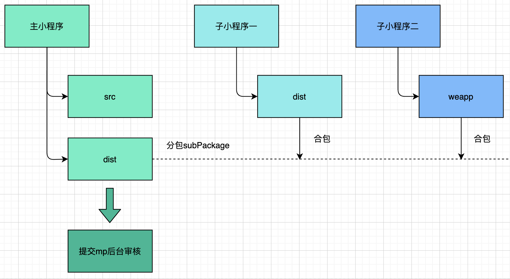

# 小程序分包合并命令行工具
工具主要提供微信小程序独立分包的合包功能，除此之外还提供独立微信开发者工具之外的代码编译、代码功能。让开发者不需要关心分包合并、代码编译、代码压缩等东西，支持CI流程引入和本地开发引入。

## 背景
小程序新的特性独立分包，我们可以把两个工程通过本项目命令合并为一个项目。各个项目开发时各自独立，在编译阶段合并在一起，这样各个小程序开发、访问各自独立。且不会有小程序跳转的弹窗，可以适应较大程序的分治管理。

本工具与具体的小程序框架无关，是建立在小程序分包的基础上的。目前支持下面几种开发框架的混合合并

- 原生小程序
- wepy1/2
- kbone

## 原理


## 安装

```bash
sudo npm i -g mp-merge-cli@latest
```

## 使用
如A为子项目，B为主项目，A项目build后产物路径相对当前路径为`./indepent`，B项目build后产物路径相对当前路径为`../B/dist`，A包的主入口为`./pages/main`。
则命令执行如下，工具会自动清空目录构建两个项目并注入脚本完成分包合并。

### wepy1/2
```bash
mm cleanTargetOutput cleanSourceOutput independent -o './indepent' -O '../B/dist' -e './pages/main'

# 上下一样
mp-merge cleanTargetOutput cleanSourceOutput independent -o './indepent' -O '../B/dist' -e './pages/main'
```

### kbone
因kbone依赖开发者工具的ES6转ES5或增强编译，所以本工具对构建产物进行babel转化和代码uglifyjs压缩

```bash
mm babelCompile uglifyjsCompress cleanTargetOutput cleanSourceOutput independent -r "kbone" -c "npm run build:mp" -o './dist/mp' -O '../B/dist'
```

## 参数说明

| 参数名               | 含义                 | 默认值        | 是否必传 |
| -------------------- | -------------------- | ------------- | -------- |
| -c或--sourceCmd      | 源目录编译命令       | npm run build | 是       |
| -C或--targetCmd      | 目标目录编译命令     | npm run build | 是       |
| -o或者--sourceOutput | 源目录产物目录       | 无            | 是       |
| -O或者--targetOutput | 目标目录产物目录     | 无            | 是       |
| -e或者--enterPage    | 分包入口页面相对路径 | 源目录产物目录app.json里第一个page| 否       |
| cleanTargetOutput          | 清空目标目录产物目录         | false         | 否       |
| cleanSourceOutput          | 清空源目录产物目录         | false         | 否       |
| independent          | 是否独立分包         | false         | 否       |
| preloadSubpackages          | 是否分包预加载         | false         | 否       |
| babelCompile          | 是否对源目录产物进行babel7编译         | false         | 否       |
| uglifyjsCompress          | 是否对源目录产物进行uglifyjs代码压缩         | false         | 否       |
| -g或--glob          | uglify代码压缩传入的glob匹配压缩文件        | './**/*.js'         | 否       |
| -i或--globIgnore          | uglify代码压缩传入的glob忽略文件        | '\*\*/node_modules/\*\*'         | 否  |

## 示例
可以看`./example`的demo示例，[这里](./example/README.md)

## 调试
其中`DEBUG=mm:*`为环境变量，调试用。

```bash
DEBUG=mm:* xxx
```

## 帮助
安装后可以命令行查看命令
```
mm --help
```

## 特性
- 2020-06-15 v1.0.1增加分包预加载支持
- 2020-06-29 v1.1.0增加kbone合包支持,babel代码编译,uglifyjs代码压缩
