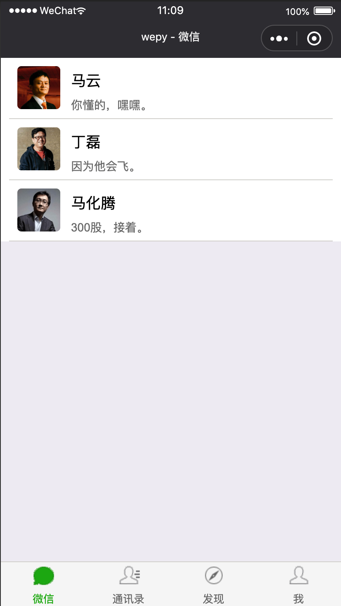
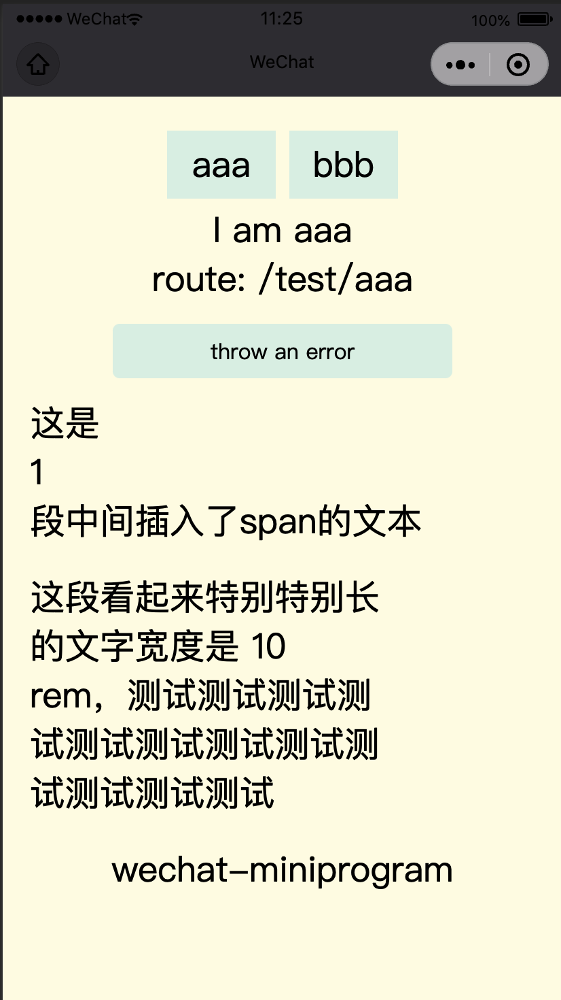

# 合包示例

- kbone-demo1 from[https://github.com/Tencent/kbone/tree/develop/examples/demo1](https://github.com/Tencent/kbone/tree/develop/examples/demo1)
- wepy-wechat-demo from[https://github.com/wepyjs/wepy-wechat-demo](https://github.com/wepyjs/wepy-wechat-demo)

## 操作方法
运行当前目录的`merge.sh`脚本

```bash
sh merge.sh
```

我们以wepy-wechat-demo为主小程序，将其他两个通过合包工具合并进去，大致目录会是这样。

```bash
wepy-wechat-demo
  - dist 主小程序目录
    - kbone kbone小程序目录，对应上面的kbone-demo1项目
```

微信开发工具打开项目目录miniprogram-demo，会看到如下


添加编译模式切换为目录`kbone/pages/index/index`则为kbone项目的页面



